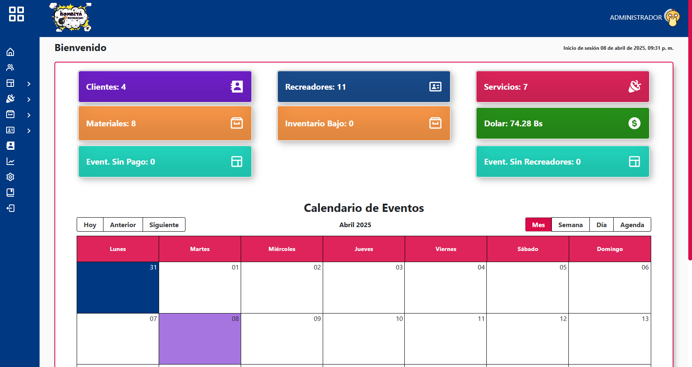
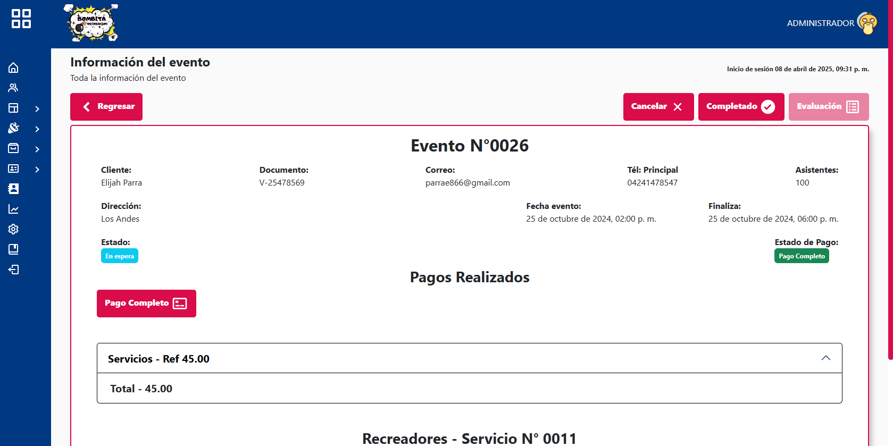
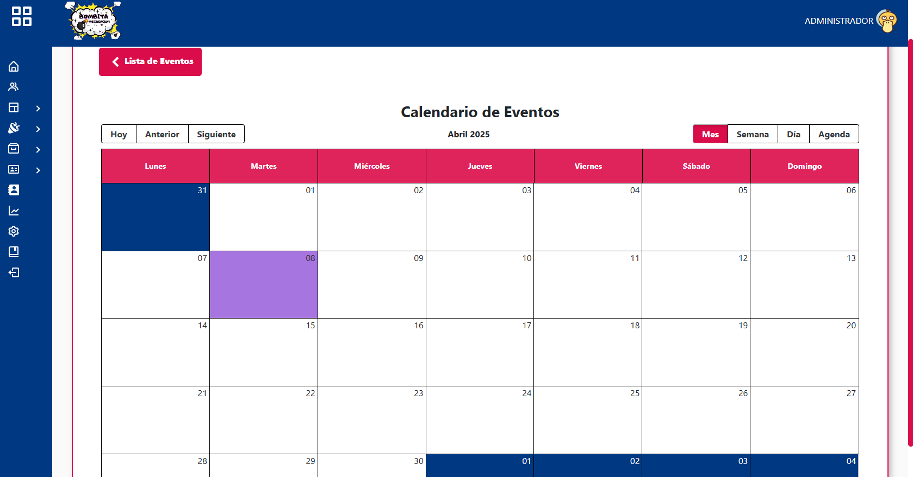
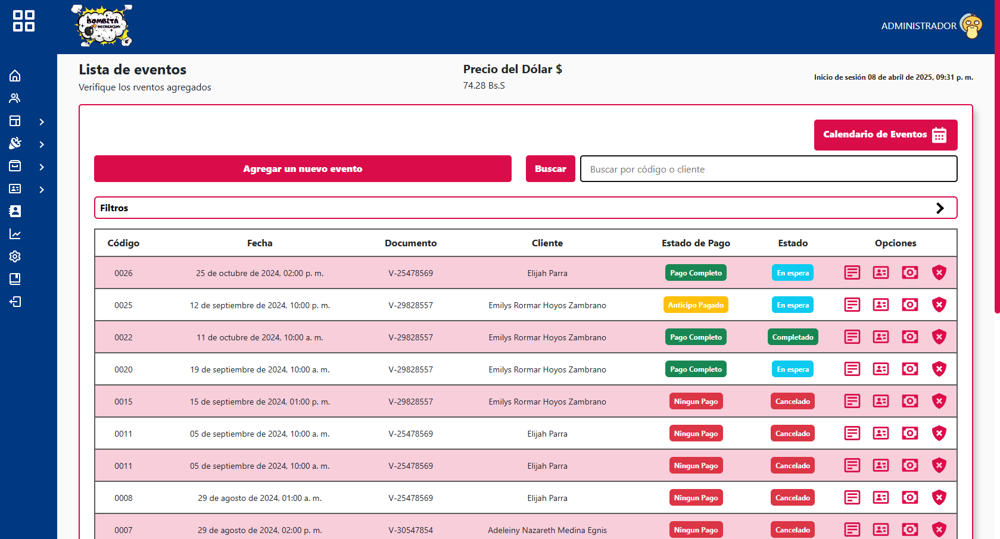

   

<h1 align="center">Automated Administrative Control System for Recreational Events</h1>

Automated administrative control system for recreational events, with login, event registration, event participants, and clients, an event session with its calendar, payment log, and inventory management.

### 🛠 &nbsp; Tools
- React 
- BootsTrap 
- Python 
- Django 
- MySQL 

### 🔐ENV BACKEND

- SECRET_KEY = *Clave Secreta de django* [recomendacion: django-insecure-2&h!hmk-3ilmrw8+t!b39ulhawokq55%0t(^gg)*6!!re]
- KEYZIP = *Clave Secreta para encriptar los respaldos* 
- NAME_BASE_DATOS = *Nombre de la base de datos*  [recomendacion: bombita_recreacion]
- USER = *Usuario de la base de datos* 
- PASSWORD = *Password de la base de datos* 
- PORT = *Puerto de ejecucion de la base de datos*  [recomendacion: 3306]
- HOST = *Host de ejecucion de la base de datos*  [recomendacion: 127.0.0.1]
- TOKEN = *Clave secreta del jwt* 
- URL = *Url de ejecuion del backend para presentar las imagenes*  [recomendacion: http://127.0.0.1:8000/] 
- RUTA_RAIZ = *Clave Raiz del sistema*  [recomendacion: C:]
- CORREO = *Correo electronico para mandar correos*
- PASSWORDCORREO = *Clave secreta dada por google para aplicaciones externas*

*Dependency Files*
./package.json  | npm install
./backend/requirements.txt  | pip install -r requirements.txt

- Start the project with the commands
* frontend | npm run dev
* backend | python manage.py runserver

### Preview

 

 

 

 